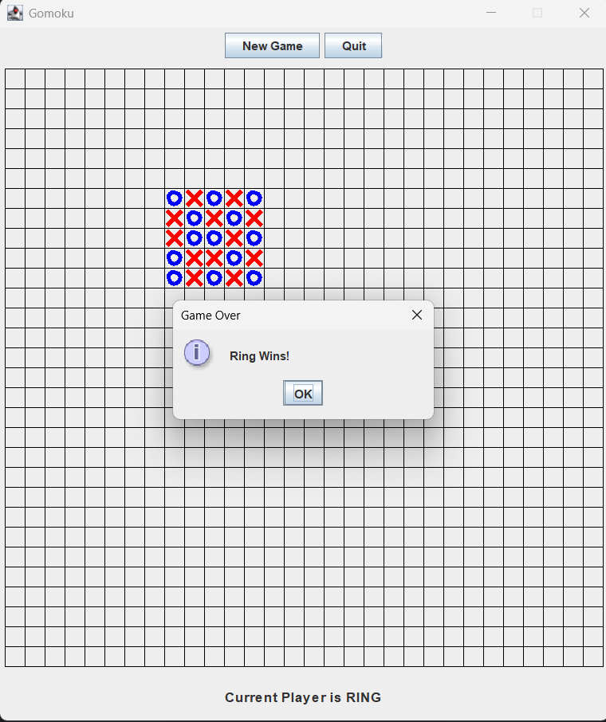
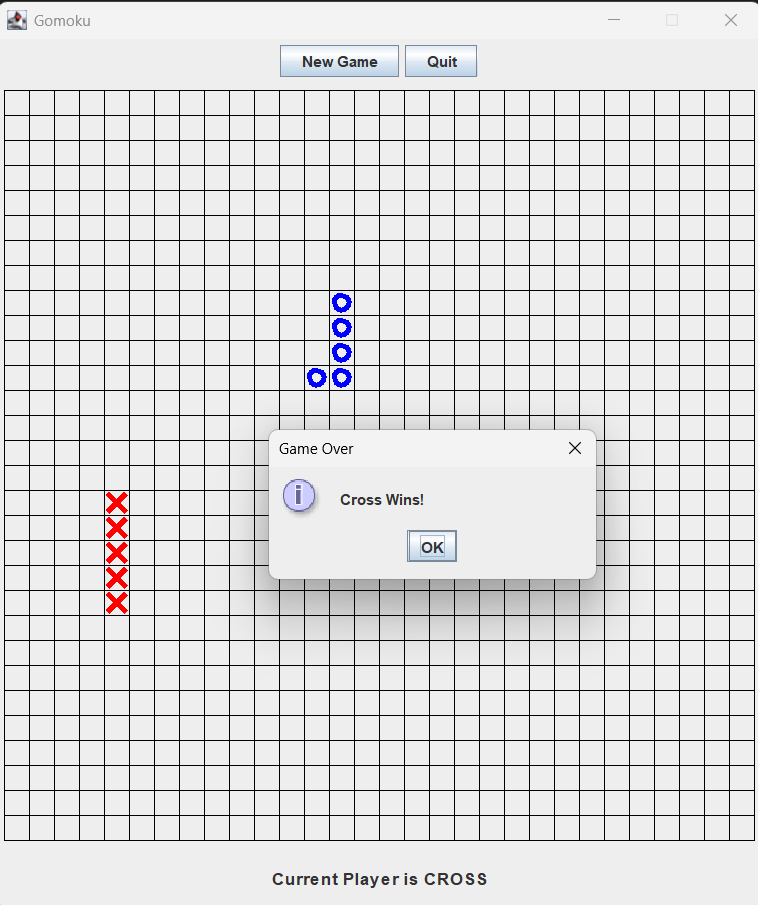

# Gomoku Game

<div style="display: flex;">   </div>


**Author:** Aayush Kafle  
**Class:** CS-251L-005 (Spring 2022)  
**Date Submitted:** 02/19/2022

## Description

This project is a command-line implementation of the Gomoku game, similar to Tic-Tac-Toe. The game is played between two players who take turns placing their pieces (rings or crosses) on the board. The goal is to be the first player to get five consecutive pieces in a row, column, or diagonal. The game also checks for a draw condition if the board is filled without any player achieving five in a row.

### Winning Conditions:

1. A player wins if they have five of their pieces in a consecutive row, column, or diagonal.
2. The game will declare a draw if no player wins and the board is completely filled.

### Error Handling

- The game will ensure only valid moves can be made on empty squares.
- It alternates between players and keeps track of the winner.

## Usage

To run the program, compile it using `javac` and execute it:

```bash
javac Gomoku.java
java Gomoku
```

## Example Output
- Ring Wins:
O O O O O
- Cross Wins:
X X X X X

