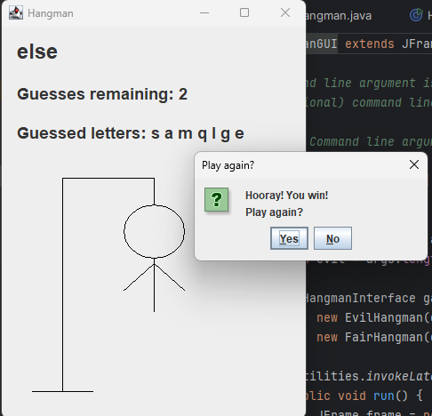
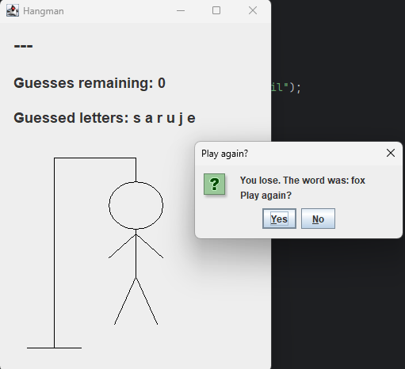

# Hangman Game

<div style="display: flex; justify-content: space-around;">
    
    
</div>

## Description

This project features a Hangman game implemented in both a console application and a graphical user interface (GUI). The console version displays ASCII art for the hangman figure, while the GUI version provides a more interactive experience with a graphical representation of the hangman figure.

### Console Version

The console version of Hangman allows users to play the game through a text-based interface. It provides ASCII art for the hangman figure, updates the user with the number of guesses remaining, and displays the current state of the word being guessed.

### GUI Version

The GUI version of Hangman provides a graphical interface using Java Swing. It includes a graphical representation of the hangman figure, displays the current state of the word, and shows the number of guesses remaining.

## Features

- **Console Version:**
  - ASCII art representation of the hangman figure.
  - Display of guessed letters and remaining guesses.
  - Option to play again after the game ends.

- **GUI Version:**
  - Graphical representation of the hangman figure.
  - Display of the current state of the word and guessed letters.
  - Option to restart the game or exit.

## Requirements

- Java 8 or higher
- A text editor or IDE (e.g., IntelliJ IDEA) for running the code

## Usage

### Console Version

1. **Compile the Program:**

   Navigate to the directory containing `Hangman.java` and compile the program using:

   ```bash
   javac Hangman.java
   ```
   
2. **Run the Program**

    java Hangman #file-name# evil

 **Example**

 java Hangman dictionary.txt evil

### GUI Version

javac HangmanGUI.java

java HangmanGUI dictionary.txt evil
