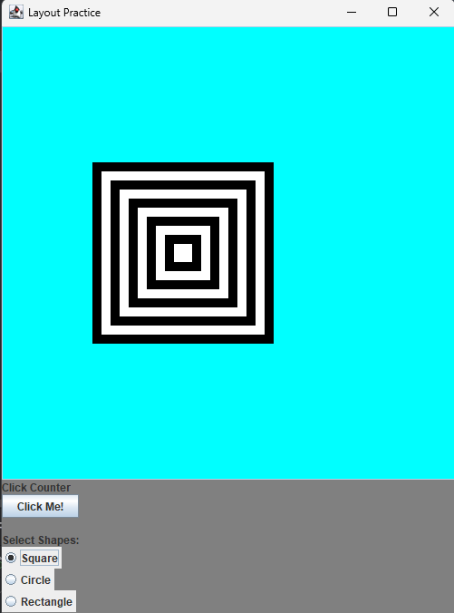

# Layout Practice - GUI Layout Application



**Name:** Aayush Kafle  
**Class:** CS-251L-005 (Spring 2022)  
**Email:** akafle1@unm.edu  
**Date Submitted:** 04/25/2022

## Description

This Java Swing application allows users to interact with a GUI to draw different shapes and keep track of button clicks. The application features:

- A panel where users can draw different shapes (square, circle, or rectangle) based on their selection.
- A button that counts and displays the number of times it has been clicked.

### Features

- **Shape Drawing:** Users can select from three shapes (square, circle, rectangle) to be drawn on the panel.
- **Click Counter:** A button counts and displays how many times it has been clicked.

## Running the Application

1. **Compile the Program:**

   ```bash
   javac LayoutPractice.java
    ```
2. **Run the Program**
    ```base
    java LayoutPractice
    ```