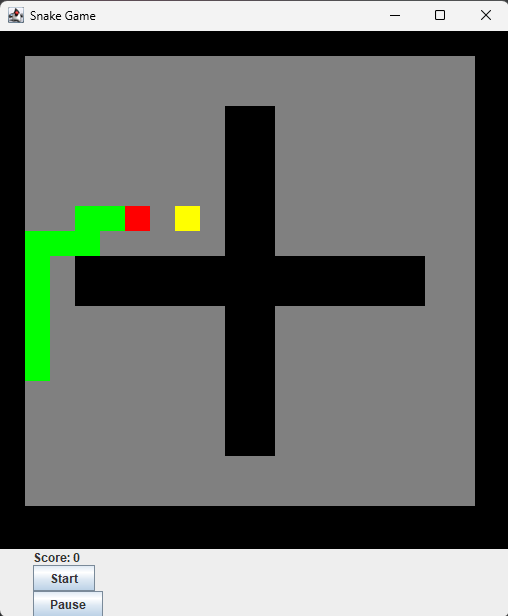

# Snake Game

## Program Description
The attached file is the **Snake Game**, which consists of four classes: `Food`, `GameManager`, `Snake_GUI`, and `Wall`.

- **GameManager**: Handles parsing of the maze file, moving the snake, and returning the board in an array format.
- **Snake_GUI**: Uses `GameManager` to run the graphical interface and control the snake's movement.
- **Food**: Manages the food logic, including generating new food when the snake eats.
- **Wall**: Represents the walls in the maze layout.

When the program or the JAR file is executed, the game starts with the snake moving **upward** at a slow speed. The direction of the snake can be controlled using the **arrow keys**. The speed of the snake can be adjusted by changing the `Delay` variable in the `Snake_GUI` class.

### Controls
- **Up Arrow**: Moves the snake upward.
- **Right Arrow**: Moves the snake rightward.
- **Left Arrow**: Moves the snake leftward.
- **Down Arrow**: Moves the snake downward.

### Game Mechanics
- **Snake Head**: Red rectangle.
- **Snake Body**: Green rectangle.
- **Food**: Yellow square. When the snake eats food, new food is generated.
- **Walls**: Black rectangles.

Every time there is a change in the GUI, the board is also printed in the console. If the snake collides with a wall or itself, the program ends and closes automatically.

### Customization
You can modify the speed of the snake by changing the `Delay` variable in the `Snake_GUI` class.

## Criticism and Known Issues
- The program ends abruptly without an option to restart the game.
- There is no message displaying the player's score at the end of the game because the counter is not functioning properly.
- The **counter** was supposed to increment whenever the snake eats food, but due to an issue in the code, it does not work.
- As the snake's starting position is random, sometimes the game might end immediately if the snake is placed near a wall. If this happens, try running the program again for a proper game session.

**Note**: You may need to run the program multiple times due to the snake's random initial placement. Thank you for playing!

---

